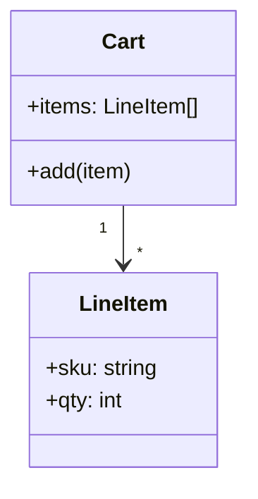

# UML — Class diagram (L3/L4)

> **FICTITIOUS** — domain types. **Family:** static.

```mermaid
classDiagram
    class Cart {
        +items: LineItem[]
        +add(item)
    }
    class LineItem {
        +sku: string
        +qty: int
    }
    Cart "1" --> "*" LineItem
```

**Shows well:** types, fields, associations.  
**Poor at:** runtime message order.
