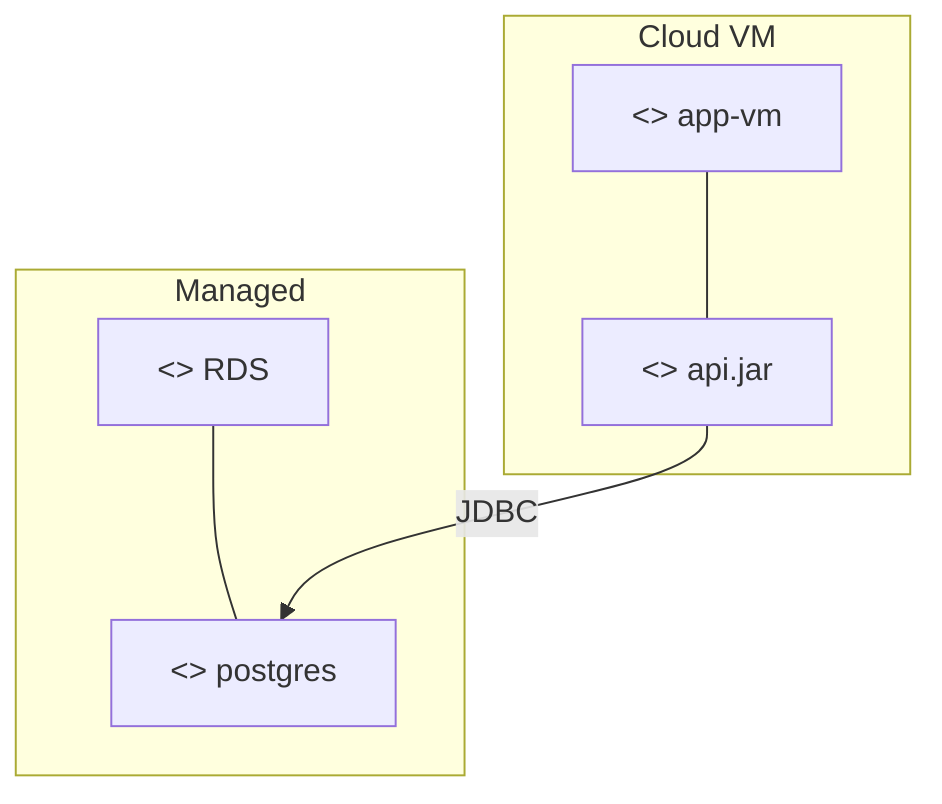

# UML — Deployment diagram (L2)

> **FICTITIOUS** — where containers run. **Family:** static.

```mermaid
flowchart TB
    subgraph Cloud VM
        node1[<<device>> app-vm]
        art1[<<artifact>> api.jar]
        node1 --- art1
    end
    subgraph Managed
        node2[<<device>> RDS]
        art2[<<artifact>> postgres]
        node2 --- art2
    end
    art1 -->|JDBC| art2
```

**Shows well:** nodes and deployed artifacts.  
**Poor at:** business rules; BPMN task order.
