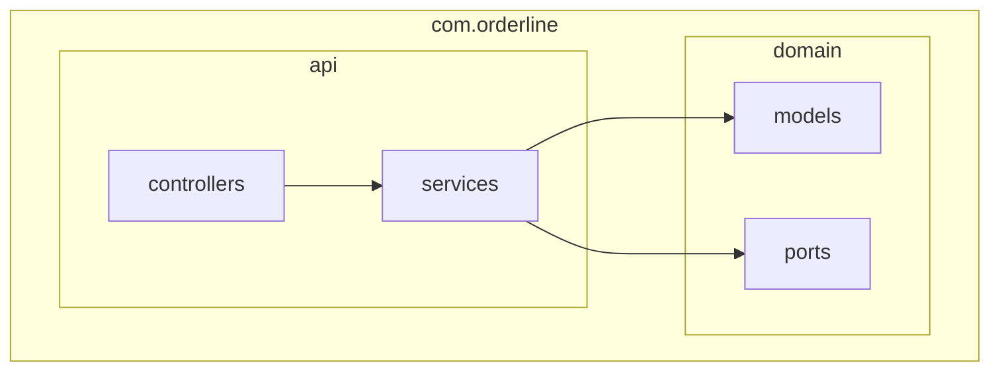

# UML — Package diagram (L2)

> **FICTITIOUS** — codebase areas. **Family:** static.

```mermaid
flowchart TB
    subgraph com.orderline
        subgraph api
            controllers[controllers]
            services[services]
        end
        subgraph domain
            models[models]
            ports[ports]
        end
    end
    controllers --> services
    services --> models
    services --> ports
```

**Shows well:** namespace / module grouping.  
**Poor at:** production network topology (use deployment).
