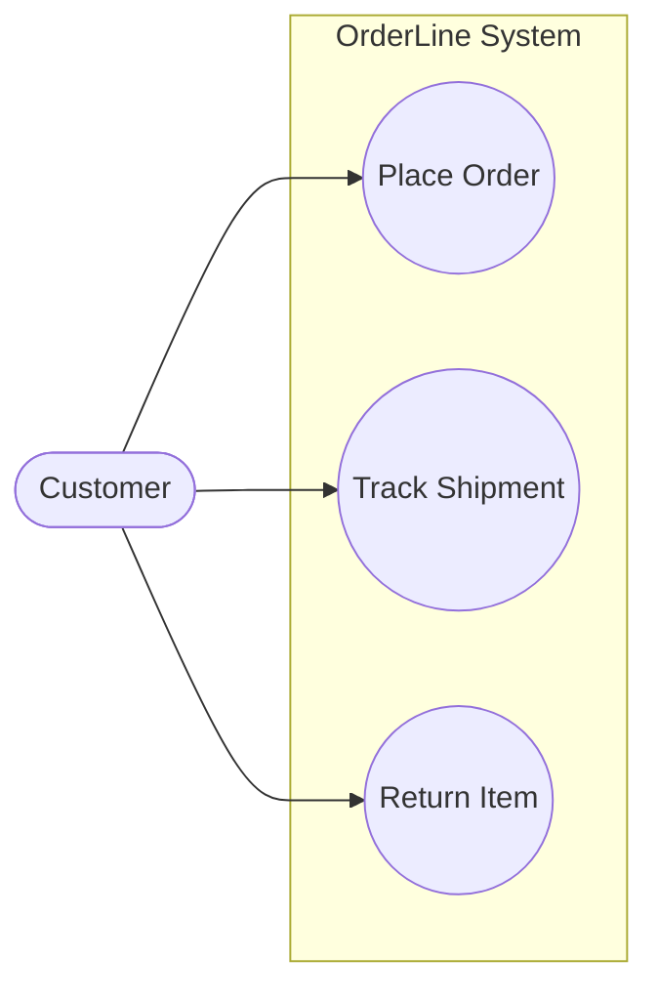

# UML — Use case diagram (L1)

> **FICTITIOUS** — OrderLine goals. **Family:** dynamic/spec.

```mermaid
flowchart LR
    Customer([Customer])
    subgraph OrderLine System
        UC1((Place Order))
        UC2((Track Shipment))
        UC3((Return Item))
    end
    Customer --> UC1
    Customer --> UC2
    Customer --> UC3
```

**Shows well:** actors and system capabilities.  
**Poor at:** order of steps; internal APIs.
